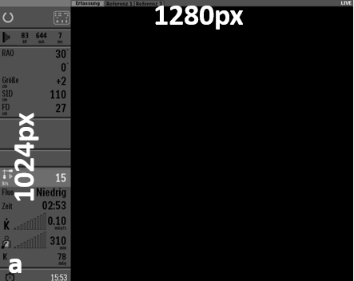

# XRAY Frame Grabbing

A quite simple helper scripts for frame grabbing using USB-Video interface cards (e.g. [epiphan DVI2USB](https://www.epiphan.com/products/dvi2usb-3-0/) or [no-name usb dongle from amazon](https://www.amazon.de/DIGITNOW-Videoaufnahmekarte-Camcorder-unterst%C3%BCtzt-Broadcast/dp/B0895N9KM5/ref=sr_1_11?__mk_de_DE=%C3%85M%C3%85%C5%BD%C3%95%C3%91&dchild=1&keywords=hdmi+usb&qid=1618504480&sr=8-11))  
Recognition and extraction of image data and geometry information from display of clinical Philips XRAY C-arm system (example images shown above) is initially supported.   
Consecutive secondary capture DICOM files with relevant metadata are produced as a result of script execution.   
